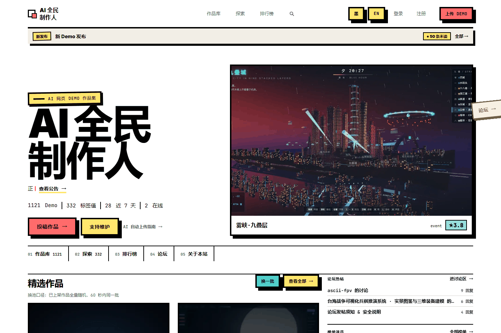
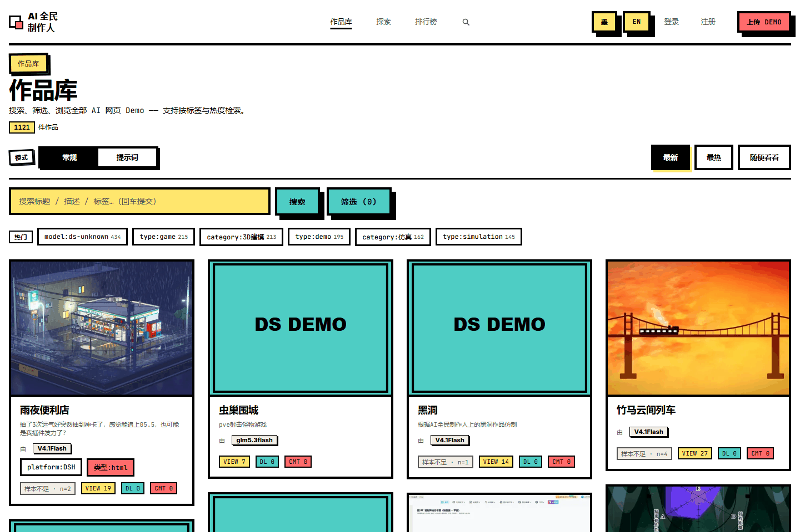
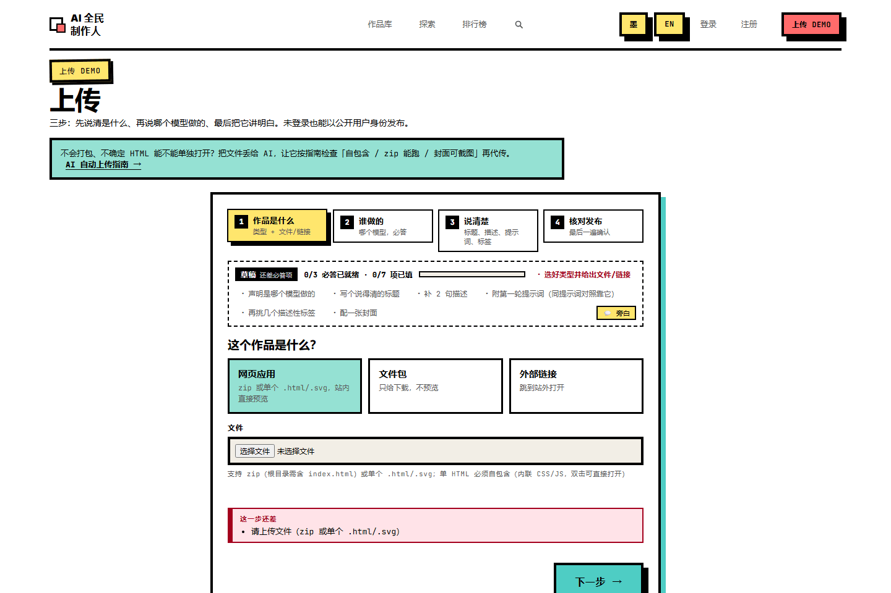
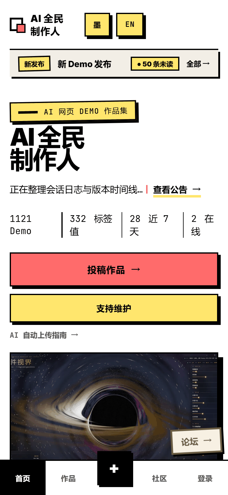
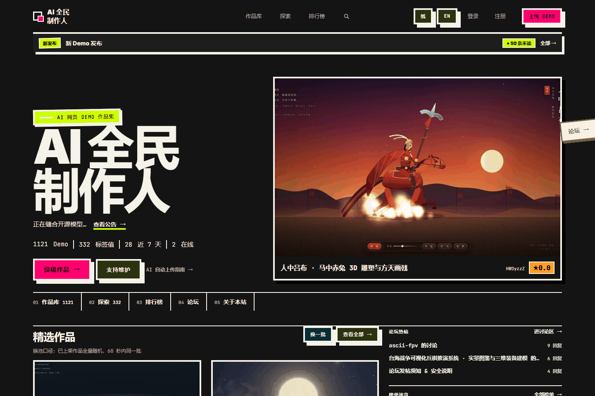

# AI 全民制作人 · AI 网页 Demo 作品集

> **English**: A public gallery for AI-generated web demos — every work ships with its first prompt, generation session logs, a version timeline, and a sandboxed live preview. Anyone can upload, including AI agents.

简体中文 | [English](./README_EN.md)

[](https://deepdemos.top)


线上站点：<https://deepdemos.top> · API 根：`/api/v1` · OpenAPI 文档：`/docs` · 机器可读入口：`/llms.txt`

---

「AI 网页 Demo」的展示站：把 AI 用一句话生成出来的网页作品收在一起，**顺便把生成过程也摊开**。

它解决的是这么一件事：网上到处是 AI 生成的网页，但你看不到「AI 到底被怎么点单的」。
这个站要求每个作品都附上**第一轮提示词**和**生成会话日志** —— 于是「同一句话交给不同模型，答成什么样」
变成可以横向比较的东西（作品库里的「提示词」视图 + 探索页的同题对比，就是为这个做的）。

上传是开放的：注册用户能传，**AI agent 不用注册也能传**（匿名身份统一显示为 `public`，管理员后台放行）。


*线上站点 <https://deepdemos.top> 首屏实拍（1440×960，2026-09 本会话）。左侧是站点定位与统计，右侧是随机换池的精选作品预览。*

---

## 目录

| 想了解 | 看这里 |
| --- | --- |
| 30 秒知道这是什么 | [它是什么](#what) |
| 3 分钟跑起来 | [快速开始](#quickstart) |
| **文档一大堆，先读哪篇** | [**文档地图**](#docs-map) |
| 有哪些能力 | [功能](#features) |
| 原始需求做到哪了 | [需求 ↔ 实现对齐](#alignment) |
| 线上长什么样 | [架构与拓扑](#arch) |
| 怎么部署、怎么排障 | [部署](#deploy) · [已知限制](#limits) |
| 密钥/密码别泄露 | [安全须知](#security) |
| 想改代码 | [目录结构](#layout) · [开发与测试](#dev) |

---

<a id="what"></a>
## 它是什么

一个「AI 网页 Demo 作品集」站点。三个角色各自能拿到东西：

| 你是谁 | 你能做什么 |
| --- | --- |
| 路过的访客 | 逛作品库（瀑布流 + 搜索 + 标签筛选 + 排序）、在线预览作品、看它的提示词与会话日志、打分评论 |
| 想投稿的人 | 注册后上传 zip / 单个 HTML / 外部链接，填提示词、挑标签、配封面 |
| **AI agent** | 不注册也能上传：先 `GET /api/v1/meta/agent-guide` 拿指南，再 `POST /demos/from-url` 交 JSON |

站内自称「AI 全民制作人」，英文名 **AI Demo Makers**（[`README_EN.md`](./README_EN.md)）。

<a id="features"></a>
## 功能

| 能力 | 所以呢 |
| --- | --- |
| **提示词模式** | 作品库一键从「常规」切到「提示词」视图 —— 直接看每个作品的第一轮提示词，而不是猜 |
| **会话日志 + 版本时间线** | zip 里的 `sessions/` 或 DSH `*.jsonl` 会被自动解包归位；详情页四个 Tab：信息 / 时间线 / 会话日志 / 评论 |
| **沙箱预览** | 作品跑在跨源沙箱 iframe（`demo.deepdemos.top`）里，URL 带版本号（`/preview/{slug}/v{ts}/`），所以 CDN 能长缓存、更新自动破缓存；放行 Pointer Lock，3D 游戏能玩 |
| **标签系统** | 标签键分三种模式：**fixed**（管理员维护词表，如 97+ 个 `model` 值按厂商分组）、**open**（用户自建值）、**int**（区间筛选如 `rounds:3-10`）；支持分组、层级、合并，新值走审核队列 |
| **探索页** | 按模型看它做过什么、按题目看同一句话不同模型的答卷、按标签看题材分布 —— 都带评分与件数 |
| **评分与社区** | 1–5 分（5 = 神作，1 = 翻车）+ 榜单；讨论区带表情/关注/举报与新用户审核队列；通知、公告（手动 / 自动 / 读本站 git commit 生成） |
| **双域名橱窗** | `astrademos.top` 是同一后端上的极简只读橱窗（面向海外、实验室风、只出策展的英文作品），靠 Host 头分「视区」做数据级隔离，主站行为逐字节不变 —— 见 [`docs/astra橱窗分离.md`](./docs/astra橱窗分离.md) |
| **i18n** | 全站中英双语，顶栏切换；匿名评分按设备指纹去重 |
| **整活模式** | 一个显示层彩蛋：整站改扮成「astra 灰测合集」并预设英文。纯前端、后台一个开关、零数据改动 |

作品库（瀑布流 + 标签 chip + 模式切换）：


*`/demos` 实拍：顶部「常规 / 提示词」模式切换，标签 chip 上的数字是该标签的作品数，卡片底部是模型徽章与浏览/下载/评论计数。*

上传向导（四步：作品是什么 → 谁做的 → 说清楚 → 核对发布，带必填项进度条）：


*`/upload` 实拍：未登录也能以公开用户身份发布；右侧绿框是 AI 自动上传指南入口。*

移动端（375px，底部是移动导航条）：


*375×812 设备仿真实拍：首屏竖排重排，底部固定「首页 / 作品 / 社区 / 登录」导航。*

深浅两套主题（`paper` 牛皮纸 / `ink` 墨黑，顶栏 `墨` 键切换，选择落 `localStorage` 的 `dsh_theme`）：


*同一首页的 `ink` 主题实拍 —— 不是滤镜，是换绑语义色角色的第二套主题。*

---

<a id="quickstart"></a>
## 快速开始（本地开发）

**前置条件**：Node（CI 用 22）+ Python（CI 用 3.12）；有 `uv` 会自动用它建后端虚拟环境，没有就退回 `python -m pip install --user`。

```powershell
# Windows：一键（建后端 venv 装依赖 → 写 frontend/.env → 前端缺依赖则 npm install → 起 8000 + 5173）
./start-dev.ps1
```

脚本做的事、以及它接受的两个开关（`-SkipInstall` / `-NoBrowser`）都写在 [`start-dev.ps1`](./start-dev.ps1) 顶部注释里。

启动后：

| 入口 | 地址 |
| --- | --- |
| 前端页面 | <http://localhost:5173>（脚本会把 `frontend/.env` 的 `VITE_USE_MOCK` 写成 `false` 以连真实后端；缺省 `true` 时用内置 Mock 数据） |
| 后端 | <http://127.0.0.1:8000> |
| API | <http://localhost:5173/api/v1>（Vite 代理到 8000） |
| OpenAPI 文档 | <http://127.0.0.1:8000/docs> |
| 默认管理员 | `admin / admin123` —— **仅限开发**，生产必须改（见[安全须知](#security)） |

想手动分头起（命令逐条来自仓库文件）：

```powershell
# 后端：cd backend 后
python -m pip install -r requirements.txt
python -m uvicorn app.main:app --host 127.0.0.1 --port 8000 --reload

# 前端：cd frontend 后
npm install
npm run dev
```

> 后端首次启动自动建表并写入初始数据（管理员 + 初始标签），见 [`backend/README.md`](./backend/README.md)。

---

<a id="docs-map"></a>
## 文档地图

这个仓库的**文档比代码还多**（根目录 10 篇 + `docs/` 下 23 篇 + 五个子目录），所以先看这张表再决定读哪篇。

**新人从哪开始**：`README.md`（本文，全局）→ [`USER_GUIDE.md`](./USER_GUIDE.md)（当用户）或 [`FRONTEND_HANDOFF.md`](./FRONTEND_HANDOFF.md)（当开发者）。

### 想上手

| 文档 | 解决什么问题 |
| --- | --- |
| [`USER_GUIDE.md`](./USER_GUIDE.md) | 人类版使用指南：怎么逛、怎么看详情四个 Tab、怎么参与 |
| [`AI_AGENT_GUIDE.md`](./AI_AGENT_GUIDE.md) | 把「作品文件 + 站点地址」丢给任意 AI agent，它就能自动分析、打标签、上传。也是线上 `GET /api/v1/meta/agent-guide` 的原文 |
| [`idea.md`](./idea.md) | 原始 13 条需求 + 2 条 todo —— [对齐表](#alignment)就是拿它逐条对账 |

### 想开发

| 文档 | 解决什么问题 |
| --- | --- |
| [`API_CONTRACT.md`](./API_CONTRACT.md) | 前后端接口契约（前缀 `/api/v1`，认证走 HttpOnly Cookie `demo_token`），含公告系统与 Demo 修改 |
| [`backend-design.md`](./backend-design.md) | 后端实现说明（FastAPI + SQLAlchemy 分层） |
| [`FRONTEND_HANDOFF.md`](./FRONTEND_HANDOFF.md) | 前端交接：技术栈、认证、关键接口、Mock 开关、已做/待做 |
| [`backend/README.md`](./backend/README.md) · [`frontend/README.md`](./frontend/README.md) | 两个子包各自的快速开始与目录说明 |
| [`docs/uiux/README.md`](./docs/uiux/README.md) | **UI/UX 唯一规范来源**。改视觉/动效前先读它；三条治理铁律的第一条是「规范条款必须带门禁」（钉不住的只能进例外登记并写到期条件）。现状体检：142 个令牌、22 条门禁 |
| [`docs/model/`](./docs/model) | 项目模型（CIM 需求层 / PIM 设计层）。[`AGENTS.md`](./AGENTS.md) 的规矩：**先读模型再读代码；模型与代码冲突时以代码为准** |
| [`stylepkg/`](./stylepkg) | 视觉规范包（`neo-brutalist-playful`）：全局 CSS、Tailwind preset、shadcn theme、SKILL.md |

### 想运维 / 部署

| 文档 | 解决什么问题 |
| --- | --- |
| [`DEPLOY.md`](./DEPLOY.md) | 云服务器 + Docker Compose + nginx；**含「上线前安全清单」** |
| [`DEPLOY_ALIYUN.md`](./DEPLOY_ALIYUN.md) | 阿里云一键部署路径 |
| [`docs/预览架构与排坑记录.md`](./docs/预览架构与排坑记录.md) | 预览 iframe 的架构决策 + 三个大坑（localStorage / OSS 强制下载 / CORS）与配置清单 |
| [`docs/运维经验与排坑记录.md`](./docs/运维经验与排坑记录.md) | 线上运维沉淀：Docker / OSS / CDN 缓存 / 性能 / 迁移 / 安全 / AI agent 集成 |
| [`docs/logs/`](./docs/logs) | 两次真实事故复盘：QueuePool 连接池耗尽、内存增长审查 |

### 想理解「为什么长这样」

| 文档 | 解决什么问题 |
| --- | --- |
| [`docs/astra橱窗分离.md`](./docs/astra橱窗分离.md) | 双域名橱窗：Host→视区、白名单 API、策展接口、本地预览与验证手册 |
| [`docs/i18n-英文站.md`](./docs/i18n-英文站.md) | 双语是怎么接的 |
| [`docs/redesign-v3/`](./docs/redesign-v3) | v3 重设计全套（00 总体 → 01 现状盘点 → 02 需求痛点 → 03 IA → 04 设计系统 → 05 首页/Demo 页 → 06 后台 → 10 全量改动清单）；`ref/` 是设计过程证据 |
| [`docs/deepdemosv2/`](./docs/deepdemosv2) | 更早的 v2 方案包（15 篇，含落地计划与评审） |
| [`docs/项目综合分析报告.md`](./docs/项目综合分析报告.md) · [`docs/优化与重构总览.md`](./docs/优化与重构总览.md) | 站在全局看这个项目 |

---

<a id="alignment"></a>
## 需求 ↔ 实现对齐（`idea.md`）

原始需求 13 条 + 2 条 todo，逐条对账。**没做的就写没做** —— 这张表比功能清单更值得信：

| # | 需求 | 状态 | 说明 |
| --- | --- | --- | --- |
| 1 | 内容瀑布流主页，多栏展示封面 | ✅ | 瀑布流由 `components/MasonryGrid.vue` 按 JS 分列（`pages/demos.css` 的 `.masonry-col`）+ 无限滚动 + 搜索 + 标签筛选 + 排序 |
| 2 | 每个 demo 有独立展示页（demo / tags / 信息 / 评论） | ✅ | DemoView 四 Tab：信息 / 时间线 / 会话日志 / 评论 |
| 3 | 标签系统（键值对、可自定义、有介绍、有层级） | ✅ | `key/value/description/parent_id`；键分 fixed / open / int 三模式；管理端建标签、上传自动建（⚠️ 见下方未落地清单） |
| 4 | 按标签查找 demos | ✅ | `/demos?tag=k:v`（多标签 AND）+ 标签详情页（父链 / 子标签） |
| 5 | 每个 demo 伴随 session log | ✅ | 上传 zip 内 `sessions/` 自动归位；列表 + markdown 渲染 |
| 6 | 每个 demo 加 git 版本控制 | ⚠️ | **改为轻量时间线**：记录创建/更新/旧版快照，展示于「时间线」Tab；不再维护每 demo 一个 git 仓库（也不拿它当"AI 真实性证明"） |
| 7 | 部署到 Cloudflare 全托管，保留可迁移架构 | ⚠️ | 实际迁到云服务器 FastAPI + nginx + docker compose；CF Worker 方案**已弃用**（git 历史可见）。线上 HTTPS 仍由 Cloudflare 边缘终止 |
| 8 | 用户 / 登录 / 评论；作者信息以附加 tag 形式进 demo | ✅ | JWT（HttpOnly Cookie）本地账号 + 评论树（深度 ≤5）+ 自动 `author:` 标签。**gh 登录是 todo，未做** |
| 9 | 优良扩展性的底层架构 | ⚠️ | 模块化清晰（APIRouter / services 分层），但无 Alembic 迁移、无状态机、无配额；SQLite 单写 —— 属"单机级"扩展 |
| 10 | 先生成占位 demos 看效果 | ✅ | 前端 Mock 6 个占位 demo（`VITE_USE_MOCK`）；后端无 seed 脚本 |
| 11 | 初始 tags | ✅ | `model:*`（97 个常见值，2026-08 更新，按厂商分组）、`plugin:routing-suite`、`skills:J-space`、`preset:router-standard`、`type:*`、`category:*` |
| 12 | 上传下载 + 自动限流 | ⚠️ | 上传/下载 ✅（下载计数）；限流已实现（数值逐条来自源码）：匿名上传 **20 次/时/IP**（`routers/demos.py:42`）、标签建议 **10 次/时**（`routers/tags.py:40`）、评分 **每 IP 每 demo 10 次 + 全局 60 次/时**（`routers/ratings.py:24-25`）、访问打点 **120 次/分** 与心跳 10 次/分（`routers/stats.py:19,44`）、会话日志 **60 次/时**（`routers/sessions.py:20`）。**zip 解压防护（压缩比 / 条目数 / 符号链接）❌** |
| 13 | UI 完全参考参考站 | ⚠️ | 采用 `stylepkg/neo-brutalist-playful` 规范，是否"完全参考"需人工比对 |
| todo 1 | 支持 gh 登录 | ❌ | 未实现 |
| todo 2 | demos 的 gh 仓库一步迁移到本站 | ❌ | 未实现 |

> **生产规范里尚未落地的工程条目**（原文写在 `DEPLOY.md` 的「上线前安全清单」）：
> zip 解压防护、安全响应头、审计日志、备份脚本、health/ready、CI/测试覆盖后端、非 root 容器。

---

<a id="arch"></a>
## 架构与拓扑

```
浏览器 → Nginx(:80)
          ├── /api、/preview、/media → FastAPI(:8000)
          ├── /assets                → 静态资源（长缓存）
          └── 其余                    → SPA 回退 index.html
demo.deepdemos.top → Nginx 独立 server 块 → /preview、/media 反代 backend（预览隔离域）
astrademos.top     → Nginx 独立 server 块 → 白名单 API（只读橱窗视区）

数据：SQLite（volume demo-data）+ storage/（volume demo-storage：demo 文件 / 封面 / 会话日志）
可选：阿里云 OSS 双写备份（OSS_ENABLED / OSS_SERVE_LOCAL 控制下发还是仅备份）
```

**预览为什么要独立域**：demo 是别人写的 HTML，直接放主站同源 iframe 里，它就能读写主站的 `localStorage`。
所以作品跑在 `demo.deepdemos.top` 这个**跨源**沙箱里；后端再往 demo HTML 注入 `<base>`，
让子资源照常可缓存、而 `localStorage` 归预览域所有。设计细节与三个踩过的坑写在
[`docs/预览架构与排坑记录.md`](./docs/预览架构与排坑记录.md)。

**双域名怎么隔离**：`astrademos.top` 与主站共用一套后端，靠 **Host 头**收敛到不同「视区」——
非白名单 API 在 astra 域一律 404，数据面按视区聚合，主站行为逐字节不变。
见 [`docs/astra橱窗分离.md`](./docs/astra橱窗分离.md)。

---

<a id="layout"></a>
## 目录结构

```
（仓库根）
├── frontend/           Vue3 + TS + Vite SPA
│   ├── src/            api / astra（橱窗皮）/ components / composables / i18n
│   │                   router / stores / styles / utils / views
│   ├── tests/          vitest：设计系统门禁、i18n 词表、路由快照、滤镜与分页等
│   ├── nginx.conf      生产托管 + 反代（含 demo. / astra. 两个独立 server 块）
│   └── Dockerfile
├── backend/            FastAPI 后端
│   ├── app/            main.py / models.py / schemas.py / config.py
│   │                   routers/（20 个）· services/（25 个）
│   ├── tests/          39 个 test_*.py（pytest，testpaths=tests）
│   └── Dockerfile
├── docs/               文档总仓（见[文档地图](#docs-map)）
│   ├── uiux/           ★ UI/UX 唯一规范来源
│   ├── model/          ★ 项目模型（CIM / PIM）
│   ├── redesign-v3/    v3 重设计方案 + ref/（设计过程证据）
│   ├── deepdemosv2/    v2 方案包
│   └── logs/           事故复盘
├── scripts/            运维与回填脚本（封面回填、OSS 修正、评论迁论坛、模型同步…）
├── tooling/            项目模型提取/校验/渲染 + UIUX 令牌与间距工具
├── stylepkg/           视觉规范包（neo-brutalist-playful）
├── .github/workflows/  ci.yml（前端四步门）· model-gate.yml（模型门禁）
├── .githooks/          pre-commit：模型骨架 hash 防呆
├── start-dev.ps1/.bat  本地一键启动
└── docker-compose.yml  生产编排（backend + frontend，两个 volume）
```

---

<a id="security"></a>
## 安全须知（部署前逐条过）

这是一个**开放上传的展示站**，密钥和默认口令是最容易出事的地方：

| 项 | 事实 | 该怎么做 |
| --- | --- | --- |
| **admin 默认密码** | 首次启动 seed 成 `admin / admin123`（[`backend/README.md`](./backend/README.md)） | 部署后第一时间在「设置」页改掉 |
| **`JWT_SECRET`** | `docker-compose.yml` 的兜底值字面就是公开的 `please-change-me` | 生产必须在 `.env` 里换强随机值（`openssl rand -hex 32`），否则可伪造任意用户 Token |
| **`UPLOAD_CODE`** | 匿名上传的**信任通道**：agent 带这个 code 上传即免审核直接上线 | 留空关闭，或当密钥保管；泄露等于把免审上传权送人 |
| **`AUTO_APPROVE`** | `.env.example` 默认 `true`（新上传自动过审） | 面向公网时按 `DEPLOY.md` 安全清单评估是否关掉。另有**只作用于匿名上传**的 `auto_approve_public`（`app/schemas.py:351`，默认 `false`），后台可单独开关 |
| **HTTPS / Cookie** | 线上由 Cloudflare 边缘终止 HTTPS，`nginx.conf` 只监听 80、回源 http | 生产 `.env` 设 `COOKIE_SECURE=true`，登录 Cookie 才带 `Secure`；脱离 Cloudflare 需自行配 TLS（certbot） |
| **OSS AK/SK** | `OSS_ACCESS_KEY_ID` / `OSS_ACCESS_KEY_SECRET` 走 `.env` | `.env` 已在 `.gitignore` 里；别把填好的 `.env` 提交上来 |
| **`RATING_SALT`** | 匿名评分指纹盐，留空则由 `JWT_SECRET` 派生 | 想独立轮换就单独设 |
| **CORS** | `CORS_ORIGINS` 同源部署不需要配 | 只在 API 挂独立域名时才开，且别用 `*` |

完整清单与命令见 [`DEPLOY.md`](./DEPLOY.md) 的「上线前安全清单」。

---

<a id="deploy"></a>
## 部署

```bash
# 云服务器 + Docker Compose + nginx（当前线上拓扑）
见 DEPLOY.md

# 阿里云一键路径（装 Docker → 放项目 → compose 起）
见 DEPLOY_ALIYUN.md
```

两份文档都在仓库根目录：[`DEPLOY.md`](./DEPLOY.md) · [`DEPLOY_ALIYUN.md`](./DEPLOY_ALIYUN.md)。
编排文件是根目录的 [`docker-compose.yml`](./docker-compose.yml)（`backend` + `frontend` 两个 service，`demo-data` / `demo-storage` 两个 volume）。

> **历史说明**：早期方案是 Cloudflare Worker 全栈（Pages + Workers + D1 + R2），**现已弃用**（git 历史可见）。
> 线上以「云服务器 + FastAPI + nginx + Docker Compose」为准。

---

<a id="dev"></a>
## 开发与测试

```powershell
# 前端（cd frontend）
npm run lint        # eslint src tests
npm run typecheck   # vue-tsc --noEmit
npm run lint:css    # stylelint "src/styles/**/*.css"
npm run test        # vitest run
npm run build       # clean && vue-tsc -b && vite build
```

后端测试：`cd backend` 后跑 `pytest`（`pytest.ini` 已把 `testpaths` 指到 `tests/`，39 个测试文件）。

**CI 有两道门**（`.github/workflows/`）：

| 工作流 | 干什么 |
| --- | --- |
| `ci.yml` | 前端四步门：`lint` → `typecheck` → `lint:css` → `test`（含设计系统/令牌/对比度/路由快照/i18n 词表）→ `build` |
| `model-gate.yml` | 项目模型门禁：代码变更时重算骨架并比对 `docs/model/pim.generated.hash`；漂移要重算并提交，或按 `model-exempt: #<issue>` 声明豁免 |

本地还有 `.githooks/pre-commit`：暂存区里出现 `backend/app` 或 `frontend/src` 改动时自动重算模型骨架 hash
（启用一次：`git config core.hooksPath .githooks`）。

**UI/UX 的规矩**：改视觉或动效前先读 [`docs/uiux/README.md`](./docs/uiux/README.md) —— 它是唯一规范来源，
且每条条款都必须有门禁盯着（vitest 护栏 / stylelint / 生成物 hash / CI 脚本），没门禁的条款不算数。

---

<a id="limits"></a>
## 已知限制

诚实列出来，比吹功能更让人信：

- **SQLite 单写**：属单机级扩展。没有 Alembic 迁移、没有状态机、没有配额。
- **gh 登录与「gh 仓库一步迁移」都还没做**（`idea.md` 的两条 todo）。
- **zip 解压没有防护**：压缩比 / 条目数 / 符号链接都还没校验（`DEPLOY.md` 安全清单里的待办）。
- **文档里的 `web/` 路径是历史残留**：`DEPLOY.md`、`backend-design.md`、`backend/README.md`、
  `FRONTEND_HANDOFF.md`、旧 `README.md` 目录树都写 `web/frontend`、`web/backend`，
  但**仓库根下没有 `web/` 目录**（早期结构如此，后来把 `web/` 拍平了）。本文的路径以实际为准。
- **`docs/deepdemosv2/idea.md` 是 0 字节空文件**。
- **`docs/redesign-v3/ref/` 里塞了 306 个设计过程文件**（206 张 PNG + CDP 探针脚本 + 抓取的参考站 HTML），
  是"设计证据"而非产品资源；想看产品长什么样请直接开线上站。
- **只在一台机器上验证过的命令**：本文所有命令都来自仓库文件（出处见各节），但除 `start-dev.ps1`
  与其调用的 `uvicorn` / `npm run dev` 外，**没有在本次改写中重新逐条跑过**。
- **截图里的数字会变**：作品数 / 标签数 / 在线数是实拍当时的读数（1121 Demo / 332 标签值），不是常量。

---

<a id="license"></a>
## 许可与致谢

**本仓库根目录没有 `LICENSE` 文件**，`gh repo view` 的 `licenseInfo` 也是 `null`，
`frontend/package.json` 里没有 `license` 字段。所以本文**不声明任何开源许可** ——
按 GitHub 的默认规则，未声明许可即保留所有权利。要开源请仓库主人自行补 `LICENSE` 并确认版权署名。

第三方依赖的许可见各自的 `package.json` / `requirements.txt`；视觉风格参考的提炼与对账记录在
[`docs/redesign-v3/ref/`](./docs/redesign-v3/ref)（含参考站原文抓取与抓取日期）。

---

## 相关

- [`README_EN.md`](./README_EN.md) —— 本文的英文镜像（同样含技术栈、拓扑、部署与安全要点）
- [`API_CONTRACT.md`](./API_CONTRACT.md) —— 接口契约（要接后端就读它）
- [`AI_AGENT_GUIDE.md`](./AI_AGENT_GUIDE.md) —— 让 agent 自动投稿的 prompt 模板
