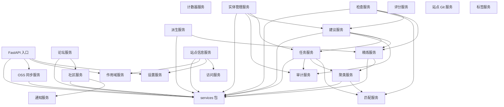

# application 层（PIM）

<!-- 由 dsh-project-model render-mermaid 生成，勿手改；数据源见注释 -->

```mermaid
flowchart TD
    main["FastAPI 入口"]
    services["services 包"]
    services_audit_service["审计服务"]
    services_cluster_service["聚类服务"]
    services_community_service["社区服务"]
    services_counters["计数器服务"]
    services_derive_service["派生服务"]
    services_entity_admin_service["实体管理服务"]
    services_forum_service["论坛服务"]
    services_inspect_service["检查服务"]
    services_matching_service["匹配服务"]
    services_notification_service["通知服务"]
    services_oss_sync["OSS 同步服务"]
    services_rating_service["评分服务"]
    services_refine_service["精炼服务"]
    services_scope["作用域服务"]
    services_settings_service["设置服务"]
    services_site_git["站点 Git 服务"]
    services_site_info_service["站点信息服务"]
    services_suggestion_service["建议服务"]
    services_tag_service["标签服务"]
    services_task_service["任务服务"]
    services_visits["访问服务"]
    main --> services
    main --> services_oss_sync
    main --> services_scope
    main --> services_settings_service
    services_cluster_service --> services
    services_cluster_service --> services_matching_service
    services_community_service --> services
    services_community_service --> services_notification_service
    services_derive_service --> services
    services_derive_service --> services_refine_service
    services_entity_admin_service --> services
    services_entity_admin_service --> services_audit_service
    services_entity_admin_service --> services_suggestion_service
    services_entity_admin_service --> services_task_service
    services_forum_service --> services
    services_forum_service --> services_community_service
    services_inspect_service --> services
    services_inspect_service --> services_matching_service
    services_inspect_service --> services_refine_service
    services_inspect_service --> services_suggestion_service
    services_oss_sync --> services
    services_refine_service --> services
    services_refine_service --> services_cluster_service
    services_site_info_service --> services
    services_site_info_service --> services_scope
    services_site_info_service --> services_settings_service
    services_site_info_service --> services_visits
    services_suggestion_service --> services
    services_suggestion_service --> services_audit_service
    services_suggestion_service --> services_refine_service
    services_suggestion_service --> services_task_service
    services_task_service --> services
    services_task_service --> services_audit_service
    services_task_service --> services_cluster_service
    services_task_service --> services_matching_service
```

<!-- 跨层依赖：→domain:34，→infrastructure:18，→web:64 -->

