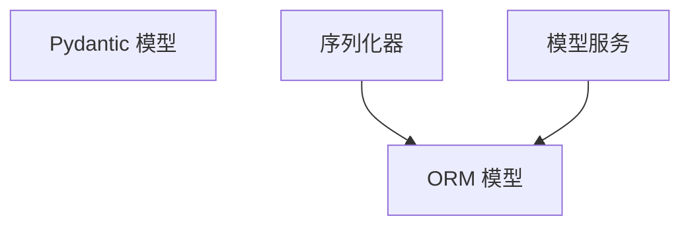

# domain 层（PIM）

<!-- 由 dsh-project-model render-mermaid 生成，勿手改；数据源见注释 -->

```mermaid
flowchart TD
    models["ORM 模型"]
    schemas["Pydantic 模型"]
    serializers["序列化器"]
    services_model_service["模型服务"]
    serializers --> models
    services_model_service --> models
```

<!-- 跨层依赖：→application:34，→infrastructure:5，→web:46 -->

