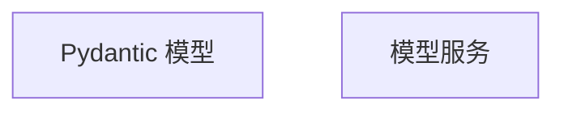

# domain 层（PIM）

<!-- 由 dsh-project-model render-mermaid 生成，勿手改；数据源见注释 -->

```mermaid
flowchart TD
    schemas["Pydantic 模型"]
    services_model_service["模型服务"]
```

<!-- 跨层依赖：→application:1，→unassigned:30，→web:4 -->

