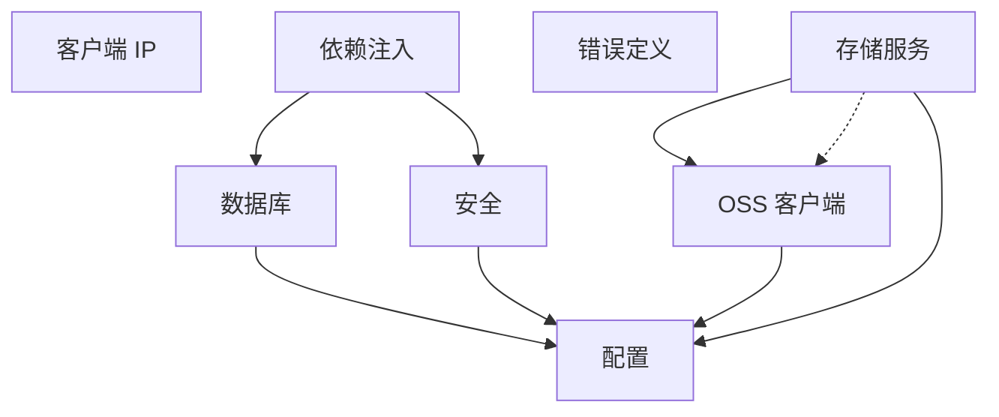

# infrastructure 层（PIM）

<!-- 由 dsh-project-model render-mermaid 生成，勿手改；数据源见注释 -->

```mermaid
flowchart TD
    client_ip["客户端 IP"]
    config["配置"]
    database["数据库"]
    deps["依赖注入"]
    errors["错误定义"]
    security["安全"]
    services_oss["OSS 客户端"]
    services_storage["存储服务"]
    database --> config
    deps --> database
    deps --> security
    security --> config
    services_oss --> config
    services_storage --> config
    services_storage --> services_oss
    services_storage -.-> services_oss
```

<!-- 跨层依赖：→application:18，→domain:5，→web:47 -->

