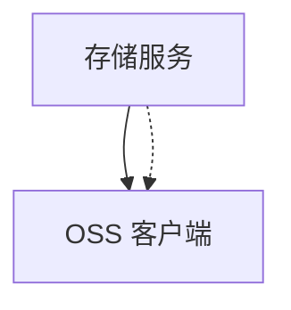

# infrastructure 层（PIM）

<!-- 由 dsh-project-model render-mermaid 生成，勿手改；数据源见注释 -->

```mermaid
flowchart TD
    services_oss["OSS 客户端"]
    services_storage["存储服务"]
    services_storage --> services_oss
    services_storage -.-> services_oss
```

<!-- 跨层依赖：→application:1，→unassigned:10，→web:3 -->

