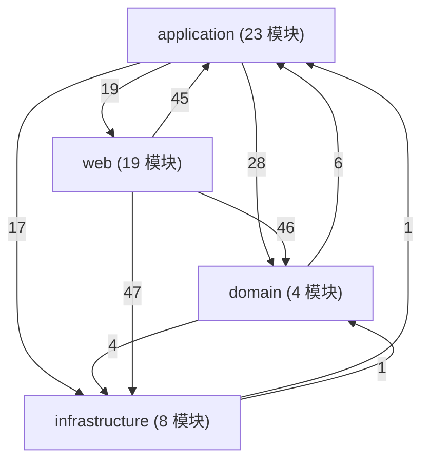

# 层概览（PIM）

<!-- 由 dsh-project-model render-mermaid 生成，勿手改；数据源见注释 -->

```mermaid
flowchart TD
    application["application (23 模块)"]
    domain["domain (4 模块)"]
    infrastructure["infrastructure (8 模块)"]
    web["web (19 模块)"]
    application -->|"28"| domain
    application -->|"17"| infrastructure
    application -->|"19"| web
    domain -->|"6"| application
    domain -->|"4"| infrastructure
    infrastructure -->|"1"| application
    infrastructure -->|"1"| domain
    web -->|"45"| application
    web -->|"46"| domain
    web -->|"47"| infrastructure
```

<!-- 层内依赖（未画边）：application:35，domain:2，infrastructure:8 -->

