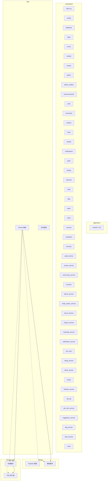

# graph-upload

<!-- 由 dsh-project-model render-mermaid 生成，勿手改；数据源为 docs/model/*.json -->

```mermaid
flowchart TD
    subgraph L_application[application]
        main["FastAPI 入口"]
    end
    subgraph L_domain[domain]
        schemas["Pydantic 模型"]
        services_model_service["模型服务"]
    end
    subgraph L_infrastructure[infrastructure]
        services_oss["OSS 客户端"]
        services_storage["存储服务"]
    end
    subgraph L_unassigned[unassigned]
        client_ip["client_ip"]
        config["config"]
        database["database"]
        deps["deps"]
        errors["errors"]
        models["models"]
        routers["routers"]
        routers_admin["admin"]
        routers_admin_entities["admin_entities"]
        routers_announcements["announcements"]
        routers_auth["auth"]
        routers_comments["comments"]
        routers_explore["explore"]
        routers_meta["meta"]
        routers_models["models"]
        routers_notifications["notifications"]
        routers_peek["peek"]
        routers_ratings["ratings"]
        routers_sessions["sessions"]
        routers_stats["stats"]
        routers_tags["tags"]
        routers_tasks["tasks"]
        routers_users["users"]
        security["security"]
        serializers["serializers"]
        services["services"]
        services_audit_service["audit_service"]
        services_cluster_service["cluster_service"]
        services_community_service["community_service"]
        services_counters["counters"]
        services_derive_service["derive_service"]
        services_entity_admin_service["entity_admin_service"]
        services_forum_service["forum_service"]
        services_inspect_service["inspect_service"]
        services_matching_service["matching_service"]
        services_notification_service["notification_service"]
        services_oss_sync["oss_sync"]
        services_rating_service["rating_service"]
        services_refine_service["refine_service"]
        services_scope["scope"]
        services_settings_service["settings_service"]
        services_site_git["site_git"]
        services_site_info_service["site_info_service"]
        services_suggestion_service["suggestion_service"]
        services_tag_service["tag_service"]
        services_task_service["task_service"]
        services_visits["visits"]
    end
    subgraph L_web[web]
        routers_demos["Demos 路由"]
        routers_forum["论坛路由"]
    end
    routers_demos -.-> services_storage
    services_storage -.-> services_oss
    routers_demos -.-> services_model_service
    routers_demos --> services_model_service
    routers_demos --> services_storage
    services_storage --> services_oss
```
<!-- workflow:上传 edges:6 -->
