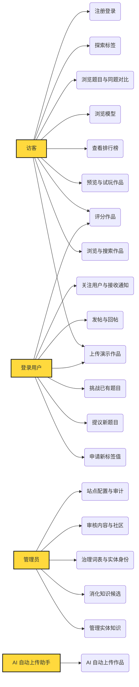

# 用例图（Use Case · CIM 视角）

<!-- 由 dsh-project-model 用例图渲染生成，勿手改；数据源 docs/model/usecase.json -->

## 图例
- 黄色火柴人 = 主要参与者（访客 / 登录用户 / 管理员 / AI 上传助手）
- 椭圆 = 用例（用户视角的动宾短语，讲 What 不讲 How）
- 实线 = 已确认（approved）；虚线 = 草案（draft，待用户在项目模型视图确认）

共 24 节点（4 actor + 20 用例）、22 条关联。
