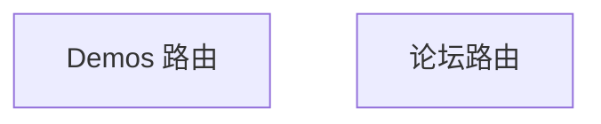

# web 层（PIM）

<!-- 由 dsh-project-model render-mermaid 生成，勿手改；数据源见注释 -->

```mermaid
flowchart TD
    routers_demos["Demos 路由"]
    routers_forum["论坛路由"]
```

<!-- 跨层依赖：→application:2，→domain:4，→infrastructure:3，→unassigned:21 -->

